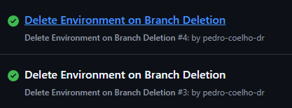

```bash
❯ kubectl get namespaces
NAME                 STATUS   AGE
default              Active   31h
gke-managed-cim      Active   31h
gke-managed-system   Active   31h
gmp-public           Active   31h
gmp-system           Active   31h
kube-node-lease      Active   31h
kube-public          Active   31h
kube-system          Active   31h
pingpong-log         Active   30h
todo-main            Active   10m
todo-test            Active   6m14s
todo-test2           Active   118s
```


```bash
❯ kubectl get namespaces
NAME                 STATUS        AGE
default              Active        31h
gke-managed-cim      Active        31h
gke-managed-system   Active        31h
gmp-public           Active        31h
gmp-system           Active        31h
kube-node-lease      Active        31h
kube-public          Active        31h
kube-system          Active        31h
pingpong-log         Active        30h
todo-main            Active        5m25s
todo-test            Active        37m
todo-test2           Terminating   33m

```


```bash
❯ kubectl get namespaces
NAME                 STATUS        AGE
default              Active        31h
gke-managed-cim      Active        31h
gke-managed-system   Active        31h
gmp-public           Active        31h
gmp-system           Active        31h
kube-node-lease      Active        31h
kube-public          Active        31h
kube-system          Active        31h
pingpong-log         Active        30h
todo-main            Active        6m38s
todo-test            Terminating   38m

```


```bash
❯ kubectl get namespaces
NAME                 STATUS   AGE
default              Active   31h
gke-managed-cim      Active   31h
gke-managed-system   Active   31h
gmp-public           Active   31h
gmp-system           Active   31h
kube-node-lease      Active   31h
kube-public          Active   31h
kube-system          Active   31h
pingpong-log         Active   30h
todo-main            Active   9m4s

```

